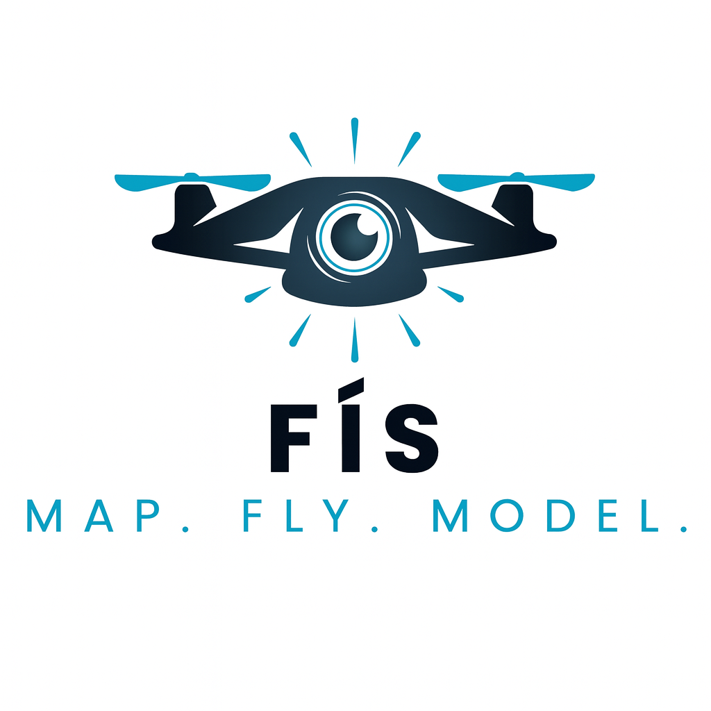
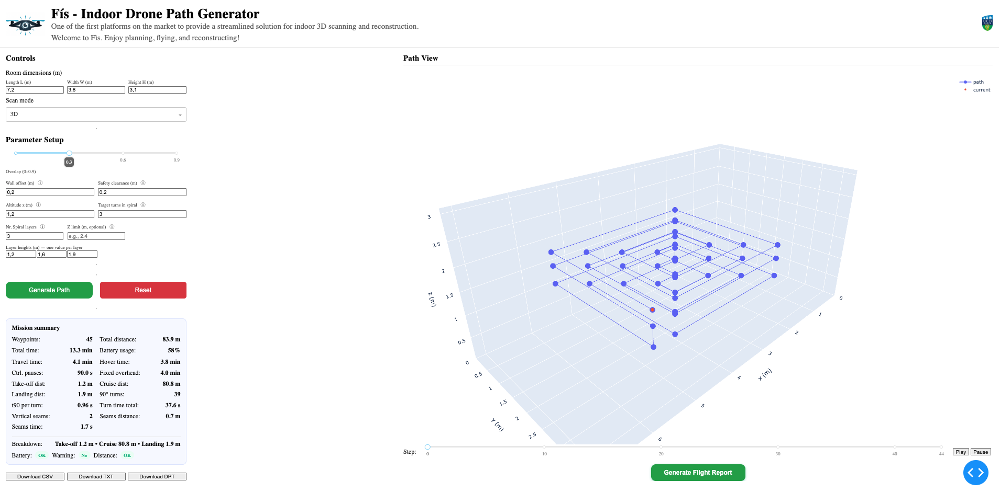
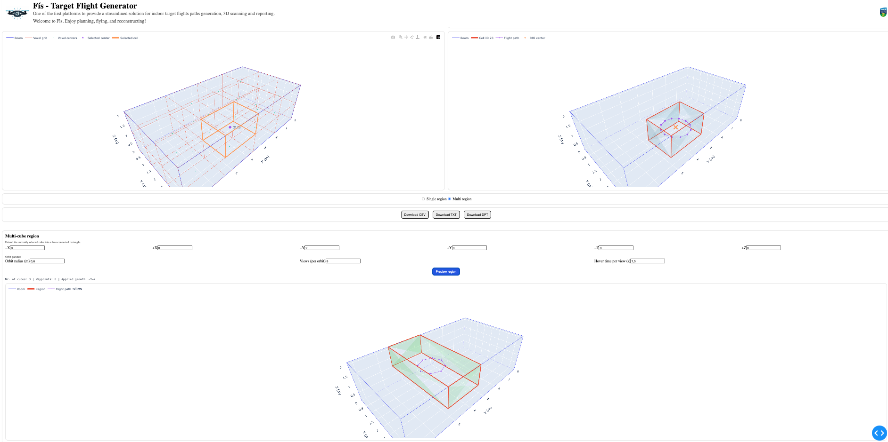

<p align="center">
  
</p>

**Applied Robotics Research Project – Academic Year 2024/25**  
Drone Team repo for Robotics Applications Summer Project 2025, University College Dublin. 

**Team Members:**  
- Benjamin Drury  
- Stefania Conte  
- John McLoughlin

---

# Flightpath Generation and Reconstruction  
*Enabling drone-based 3D and 2D flightpath generation for room reconstructions with NeRF*  

## Background and Motivation   
Services such as reconstruction, inspection, and maintenance of GPS-denied indoor environments are traditionally carried out by humans. These processes are often **costly, time-consuming, and dangerous**, especially when dealing with large or complex spaces.  

This project introduces a **dashboard for generating and validating optimal drone flightpaths** tailored to indoor room scanning. The workflow enables users to:  
1. Generate an optimized flightpath.  
2. Enable the corresponding flight mission.  
3. Collect and analyze structured logs through automated reporting.  

As part of our research, the collected data is then processed to produce **Neural Radiance Field (NeRF)** reconstructions. Compared to traditional photogrammetry, NeRF represents a **paradigm shift in 3D reconstruction**:  
- It enables more realistic and complete reconstructions of complex indoor spaces.  
- It adapts better to challenging lighting and texture conditions where photogrammetry often fails.  

By coupling **robotics-driven data collection** with **state-of-the-art NeRF reconstruction**, this project demonstrates a workflow that is both scientifically novel and highly relevant for real-world and commercial applications. The project aims to demonstrate how flightpath optimization, structured mission reporting, and NeRF-based reconstruction can be combined within a unified workflow, an area that remains largely unexplored in both research and practice.

The end goal of our work is to reduce the gap between manual surveying methods and robotics-driven automation, paving the way for safer, faster, and higher-quality digitization of indoor environments.  


## Features  
The **flightpath generator dashboard** is designed to make drone mission planning simple, efficient, and accessible.  

<div align="center">
  <br/>
  <sub>Fìs Dashboard – Initial interface for flightpath generation</sub>
</div>

With just a few inputs, users are able to:  

- **User-friendly dashboard**: input room parameters (such as dimensions, overlap, margins, etc.) and select whether to generate a 2D or 3D scanning pattern.  
- **Optimal flightpath generation**: automatically compute the most efficient path with the **minimum number of waypoints** while ensuring complete coverage.  
- **Scanning strategies**:  
  - 2D patterns: geometric shapes and waypoint-driven paths.  
  - 3D patterns: spirals adapted to vertical exploration.  
- **Mission feasibility summary**: view detailed reports on expected flight time, battery usage, and drone-specific constraints.  
- **Seamless deployment**: download ready-to-use mission files and directly import them into **Marvelmind**. Executing a flight requires only a **single file upload and a few clicks**, ensuring a smooth transition from planning to deployment.  


## Scientific Contribution and Importance  
- Advances NeRF research toward real-world drone-based capture.  
- Establishes a reproducible framework for evaluating and comparing flightpath strategies in 2D/3D scene acquisition.  
- Bridges the fields of robotics (path planning, UAV feasibility) and computer vision (scene reconstruction with NeRF and photogrammetry).  
- Demonstrates clear application as well as commercial potential for engineering domains.  

   
## Repository Structure  

The repository contains both the source code for the dashboard and the datasets collected from flight experiments.  
```
Drone-Thesis-2025/
│
├── 2D_Logs_Data/ # Logged flight data from 2D scanning missions (different shapes (spiral, lawnmower), nr. waypoints, heights, etc.)
├── 3D_Logs_Data/ # Logged flight data from 3D scanning missions (different shapes (spiral, helix, lawnmower), heights, order of scanning, lighting conditions, gimbal rotations, etc.)
│
├── FlightPath_Generation/ # Source files related to flightpath generation algorithms before implementation of dashboard
├── FlightPaths/ # CSV files of flightpaths generated for experimental settings  
│
├── Fís_Dashboard/ # Main dashboard code (flightpath generator + reporting features)
├── Fís_TargetFlight_Dashboard/ # Extended dashboard version with voxel-grid-based flight generation and reporting for targeted flights, as well as multi-region selection 
│
├── Results_Plots_RawData/ # Plots and raw experimental results used for analysis
│
├── assets/ # Figures and screenshots used in the README (logo, dashboard UI, comparisons)
│
├── README.md # Project documentation
└── ThesisPlan.xlsx # Gantt chart outlining thesis timeline and tasks 
```

## Usage  
1. Clone this repository.  
2. Launch the dashboard by running Fisdashboard.py in the Fís dashboard folder.  
3. Generate a flightpath and download the csv and dpt files.  
4. Deploy to a Marvelmind by simply uploading the dpt file.
5. Generate the flight report by uploading the flight logs and the previously downloaded csv. 
6. Use the drone media for NeRF reconstruction.
7. Enjoy!


### Reconstruction Technologies: Photogrammetry vs NeRF  
The end goal was to evaluate the effectiveness of the generated flightpaths through the reconstructions obtained with **traditional photogrammetry** and with **Neural Radiance Fields (NeRF)**. Both methods used the same input data collected from our drone flight missions.

<table align="center">
  <tr>
    <td align="center">
      <br/>
      <sub>Photogrammetry example (PolyCam)</sub>
    </td>
    <td align="center">
      <br/>
      <sub>NeRF example (Luma AI)</sub>
    </td>
  </tr>
</table>


- **Photogrammetry (PolyCam)**: while capable of reconstructing the overall geometry of a room, photogrammetry often struggles with textureless surfaces, varying lighting, and fine details. Reconstructions are typically incomplete or require significant manual post-processing.  
- **NeRF (Luma AI)**: provides a continuous volumetric representation, capturing fine structural and photometric details with fewer input images. The results demonstrate smoother reconstructions and more realistic rendering of the scanned environment.


## Additional Features - Future Work  
In addition to the standard dashboard functionalities, we developed an extended version of the system: the **target flight dashboard**. This version allows users not only to generate complete flightpaths but also to focus on **specific regions of interest within a room**.  

<div align="center">
  <br/>
  <sub>Target Flight Dashboard – voxel grid partitioning and region selection for targeted flights</sub>
</div>


Key features include:  
- **Voxel grid partitioning**: the room is automatically divided into a voxel grid, enabling precise region selection.  
- **Targeted flights**: users can configure missions that focus only on the selected regions, rather than scanning the entire room.  
- **Flexible region selection**: supports both **single-region flights** and **multi-region flights**, allowing users to combine several areas into a single mission.  
- **Efficient data collection**: by restricting the scanning process to areas of interest, missions become shorter and more efficient while still producing high-quality data for reconstruction.  

Looking ahead, the project can be extended in several important directions:  
- **Clash detection**: implementing collision and safety checks to ensure generated flightpaths avoid obstacles in real-time scenarios.  
- **BIM integration**: linking flightpath generation and reconstruction outputs with **Building Information Modeling (BIM)** systems, enabling seamless use in engineering and architectural workflows.

## Acknowledgements  
This project was carried out as part of the Applied Robotics Research Project, University College Dublin (Academic Year 2024/25). We would like to thank Associate Professor Papakostas and Engineer Liam Sutherland for their guidance and support throughout the development of this work.  


## Citation  
If you use this repository in your research, please cite:  

```bibtex
@misc{Drone-Thesis-2025,
  title={Flightpath Generation and Reconstruction: Enabling Drone-Based Room Reconstructions with NeRF},
  author={Drury, Benjamin and Conte, Stefania and McLoughlin, John},
  year={2025},
  howpublished={GitHub Repository},
}
```

## Contact  
For questions or bugs, please contact:  
- droneteambsj@gmail.com

Contributions are welcome via pull requests or issues.  

